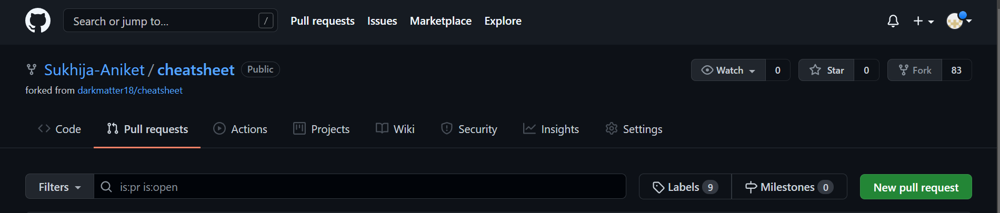

# How to Contribute


**IF you wish to contribute to this project kindly follow the below steps:**

* Inform the user that you would like to work on a certain issue.

* Fork the repository and clone it to your local device.

* Create a new branch for any issue or changes you wish to make. Browse through the repository's open issues.

* Make changes to your local repository and commit.

* push the changes to your local repository and then make the pull request.

* make sure to write a description of the changes you made.

* You can also contribute by raising an issue if you see something is missing or needs to be fixed and then working on it.

# Instructions for beginners
1) Make sure you have a github account. If you don't have a github account. You can create a new account by visiting https://github.com/ and clicking on the sign up button.

2) To contribute to this repository, fork the repository by clicking on the fork button at the top right. See the below image for reference.


3) After the fork you can see your name appearing on the top left and a forked from at the bottom as shown in the image below.


  
4) Now click on the green code button and copy the link shown in the below image.


5) This link will allow you to clone the repository in your local device. To do that run the following commands.(paste the link you copied after writing git clone)

``` 
git clone <paste link here>

```
6) now switch to the directory you cloned and create a new branch by using the following commands.(Replace branchname by any name you would like to keep)

```
cd cheatsheet

git checkout -b <branch name>

```

7) After you have made all the changes. remember to add them and commit all the changes.You can do that using the below command.

```
git add .

git commit -m <message for commit>
```

8) Now its time to push your changes back to your forked repository. in order to do that type the command.()

``` 
git push origin <branch name>
```

9) Now go to your forked repository and click on pull requests button (See the image for reference) and create a new pull request.



10)

### Thankyou for your Contribution to this project.
