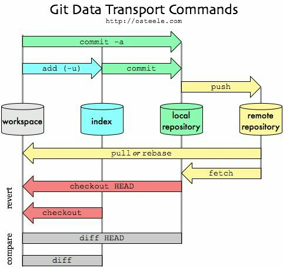

# Git and GitHub

## Git:

- [Documentation](https://git-scm.com/docs)
- [Git Tutorial](https://www.atlassian.com/git/tutorials)
- [Learn Git](https://www.atlassian.com/git/tutorials/install-git)
- [Git cheatsheet from OverAPI](https://overapi.com/git)

## Github:

- [GitHub Learning Lab](https://lab.github.com/)
- [Resources to learn Git](https://try.github.io/)
- [GitHub Guides](https://guides.github.com/)
- [GitHub PullRequest Cheatsheet](https://www.digitalocean.com/community/tutorials/how-to-create-a-pull-request-on-github)

## Cheetsheets:

- [Basic Cheat Sheet](./git-cheat-sheet-education.pdf)
- [Git Cheat Sheet](./git-cheat-sheet.pdf)

