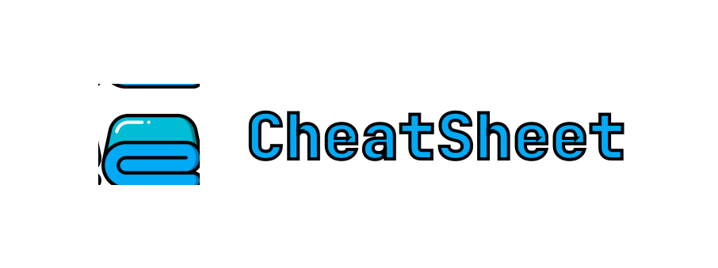
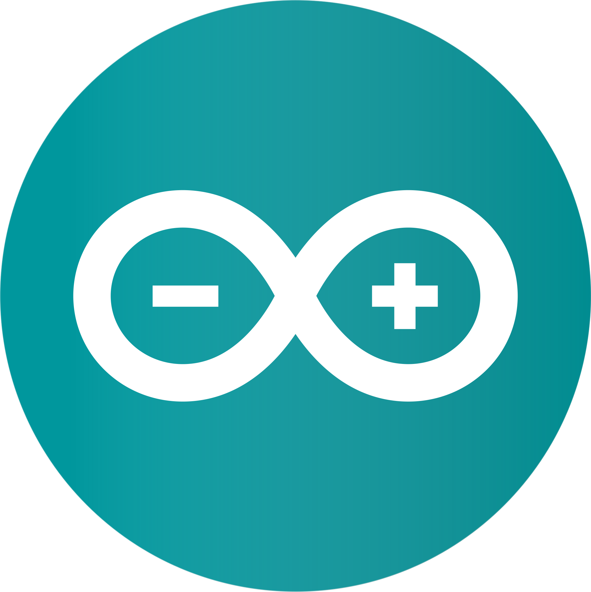
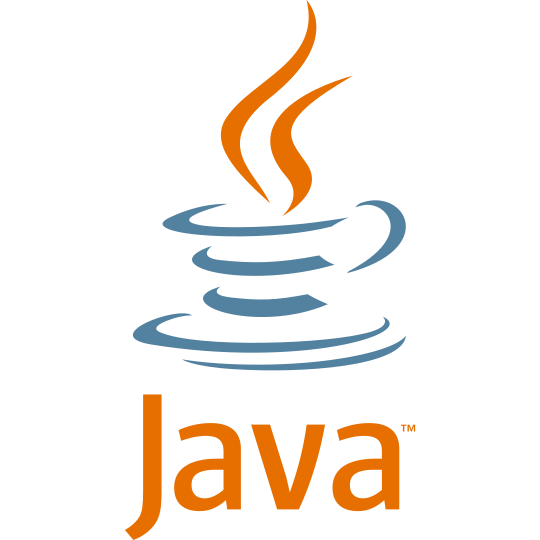
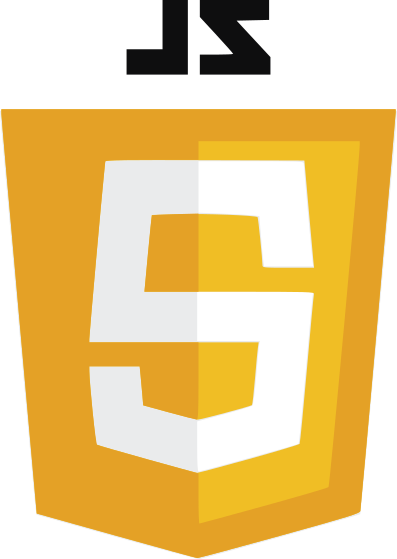
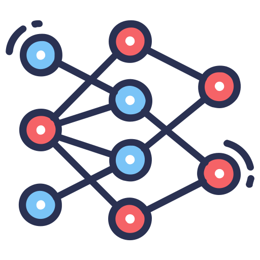
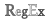

<!-- markdownlint-disable -->

 

 
 
 

<!-- markdownlint-enable -->

 
  

> This repo contains useful cheatsheets for several programming languages, CLI's and code editors.

 

## Table of Contents
---

* [Overview](#overview)
* [Contributing](#contributing)
* [Credits](#credit)
* [Contact](#contact)

## Overview
---

<!-- markdownlint-disable -->
 

Code editors

 
<table>
  <tr>
    <td align="center"></td>
    <td align="center"></td>
    <td align="center"></td>
  </tr>
  <tr>
    <td align="center"><a href="code_editors/gnu-emacs/README.md">GNU Emacs</a></td>
    <td align="center"><a href="code_editors/vim/README.md">VIM</a></td>
    <td align="center"><a href="code_editors/vscode/README.md">VS Code</a></td>
  </tr>
</table>

Programming Languages

 
<table>
  <tr>
    <td align="center"></td>
    <td align="center"></td>
    <td align="center"></td>
    <td align="center"></td>
  </tr>
  <tr>
    <td align="center"><a href="programming_languages/apache_spark/README.md">Apache Spark</a></td>
    <td align="center"><a href="programming_languages/arduino/README.md">Arduino</a></td>
    <td align="center"><a href="programming_languages/c/README.md">C</a></td>
    <td align="center"><a href="programming_languages/c++/README.md">C++</a></td>
  </tr>
  <tr>
    <td align="center"></td>
    <td align="center"></td>
    <td align="center"></td>
    <td align="center"></td>
  </tr>
  <tr>
    <td align="center"><a href="programming_languages/css/README.md">CSS3</a></td>
    <td align="center"><a href="programming_languages/dart/README.md">Dart</a></td>
    <td align="center"><a href="programming_languages/dsa/README.md">DSA</a></td>
    <td align="center"><a href="programming_languages/flutter/README.md">Flutter</a></td>
  </tr>
  <tr>
    <td align="center"></td>
    <td align="center"></td>
    <td align="center"></td>
    <td align="center"></td>
  </tr>
  <tr>
    <td align="center"><a href="programming_languages/hadoop/README.md">Hadoop</a></td>
    <td align="center"><a href="programming_languages/html/README.md">HTML</a></td>
    <td align="center"><a href="programming_languages/java/README.md">Java</a></td>
    <td align="center"><a href="programming_languages/javascript/README.md">JavaScript</a></td>
  </tr>
  <tr>
    <td align="center"></td>
    <td align="center"></td>
    <td align="center"></td>
    <td align="center"></td>
  </tr>
  <tr>
    <td align="center"><a href="programming_languages/matlab/README.md">MATLAB</a></td>
    <td align="center"><a href="programming_languages/neural_networks/README.md">Neural Networks</a></td>
    <td align="center"><a href="programming_languages/php/README.md">PHP</a></td>
    <td align="center"><a href="programming_languages/prolog/README.md">Prolog</a></td>
  </tr>
  <tr>
    <td align="center"></td>
    <td align="center"></td>
    <td align="center"></td>
    <td align="center"></td>
  </tr>
  <tr>
    <td align="center"><a href="programming_languages/python/README.md">Python</a></td>
    <td align="center"><a href="programming_languages/r/README.md">R</a></td>
    <td align="center"><a href="programming_languages/robot_operating_system/README.md">Robot Operating System</a></td>
    <td align="center"><a href="programming_languages/ruby/README.md">Ruby</a></td>
  </tr>
  <tr>
    <td align="center"></td>
    <td align="center"></td>
    <td align="center"></td>
    <td align="center"></td>
  </tr>
  <tr>
    <td align="center"><a href="programming_languages/rust/README.md">Rust</a></td>
    <td align="center"><a href="programming_languages/sql/README.md">SQL</a></td>
    <td align="center"><a href="programming_languages/statistics/README.md">Statistics</a></td>
    <td align="center"><a href="programming_languages/time_complexity/README.md">Time Complexity</a></td>
  </tr>
  <tr>
    <td align="center"></td>
    <td align="center"></td>
  </tr>
  <tr>
    <td align="center"><a href="programming_languages/typescript/README.md">Typescript</a></td>
    <td align="center"><a href="programming_languages/golang/README.md">Golang</a></td>
  </tr>
</table>

CLI

 
<table>
  <tr>
    <td align="center"></td>
    <td align="center"></td>
    <td align="center"></td>
    <td align="center"></td>
  </tr>
  <tr>
    <td align="center"><a href="cli/docker/README.md">Docker</a></td>
    <td align="center"><a href="cli/gcloud/README.md">Google Cloud</a></td>
    <td align="center"><a href="cli/git_github/README.md">Git & GitHub</a></td>
    <td align="center"><a href="cli/kubernetes/README.md">Kubernetes</a></td>
  </tr>
  <tr>
    <td align="center"></td>
    <td align="center"></td>
    <td align="center"></td>
    <td align="center"></td>
  </tr>
  <tr>
    <td align="center"><a href="cli/linux/README.md">Linux</a></td>
    <td align="center"><a href="cli/regex/README.md">Regex</a></td>
    <td align="center"><a href="cli/shell/README.md">Shell</a></td>
    <td align="center"><a href="cli/terraform/README.md">Terraform</a></td>
  </tr>
</table>

Security

 
<table>
  <tr>
    <td align="center"></td>
  </tr>
  <tr>
    <td align="center"><a href="security/cryptography/README.md">Cryptography</a></td>
  </tr>
</table>

 

<!-- markdownlint-enable -->
## Contributing
---
Contributions are what make the open source community such an amazing place to be learn, inspire, and create. Any contributions you make are greatly appreciated.

1. Fork the Project
2. Create your Feature Branch (`git checkout -b feature/AmazingFeature`)
3. Commit your Changes (`git commit -m 'Add some AmazingFeature'`)
4. Push to the Branch (`git push origin feature/AmazingFeature`)
5. Open a Pull Request
 
 

## Credits
---
This project exists thanks to all the people who [contribute](CONTRIBUTING.md).

## Contact
---
Need help? Feel free to contact me @ [in2arkadipb13@gmail.com](mailto:in2arkadipb13@gmail.com)
 
 
 
